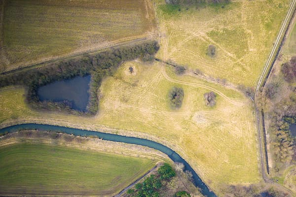
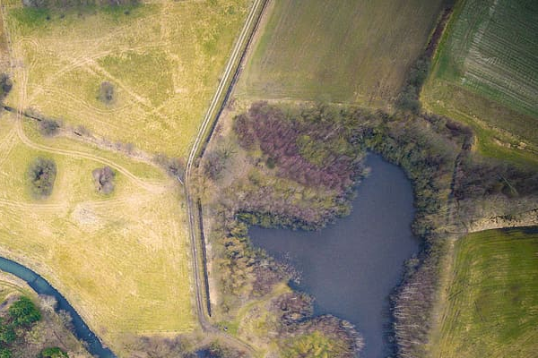
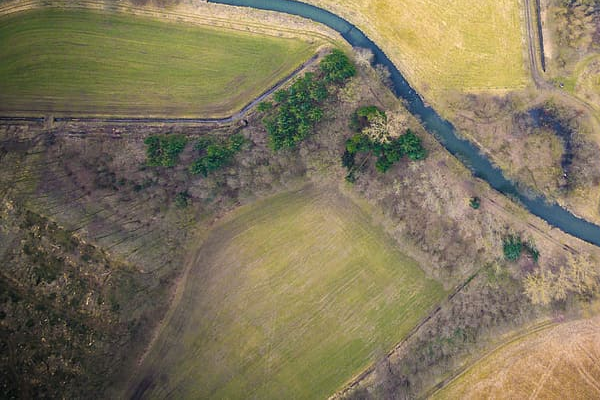
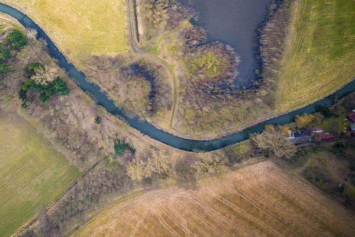
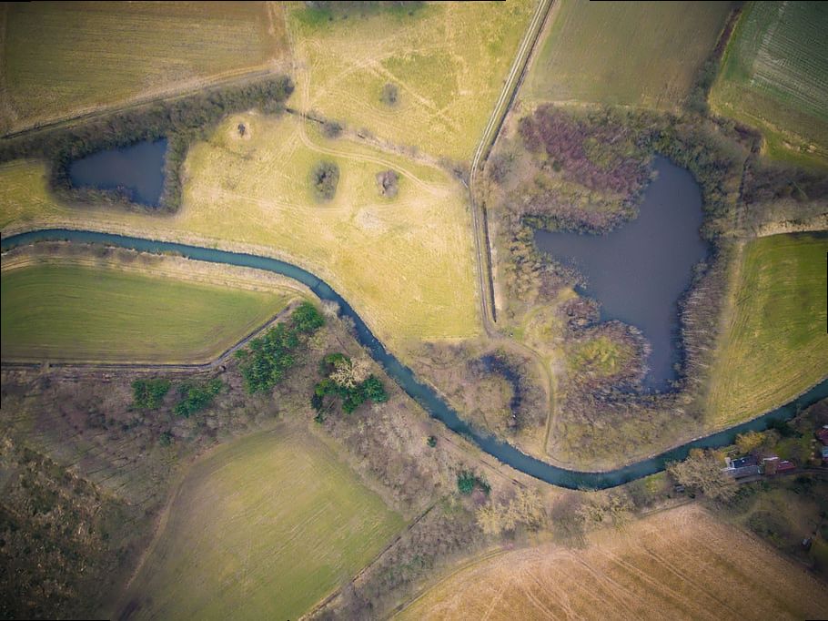
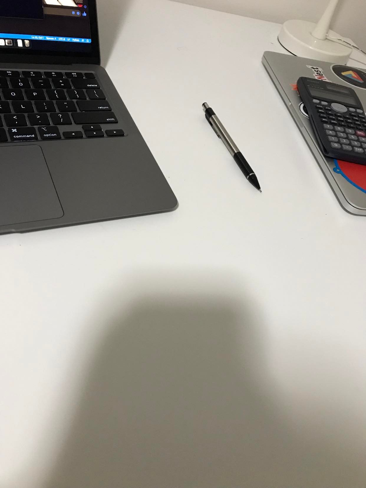
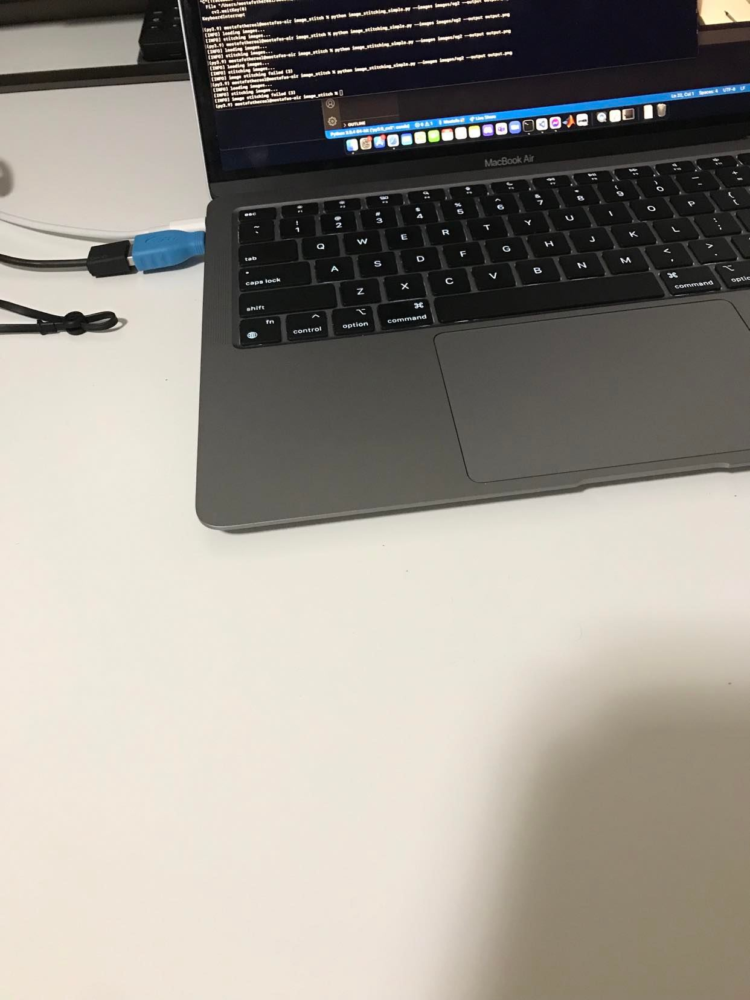
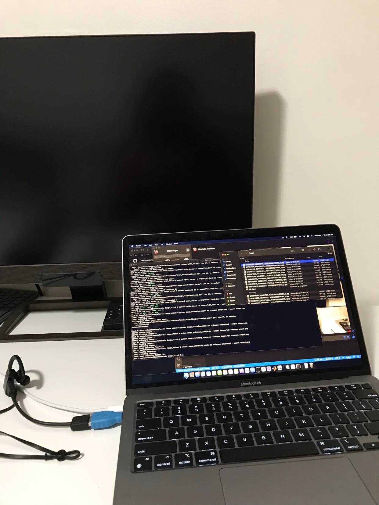
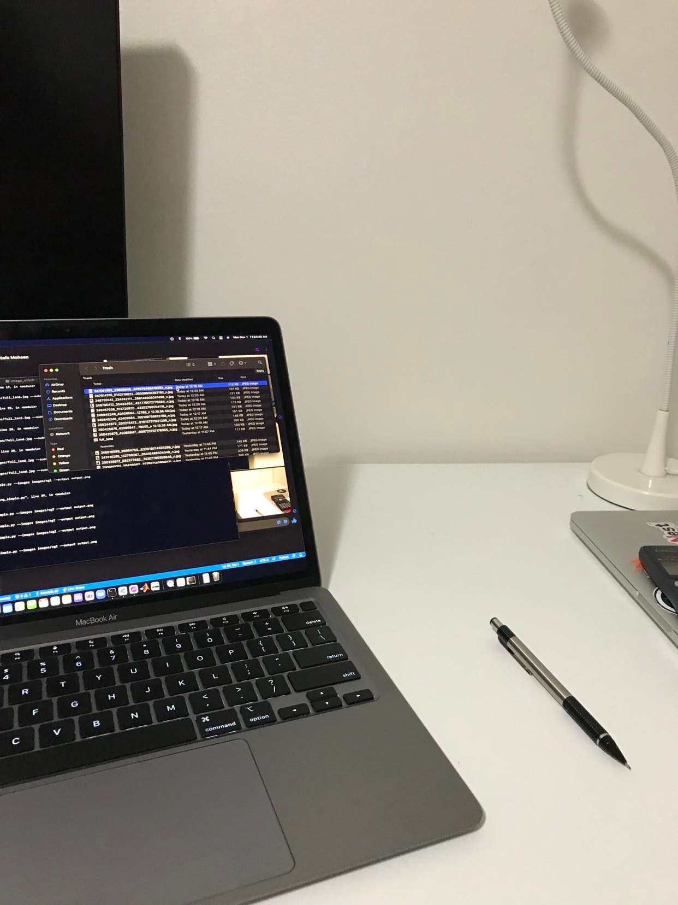
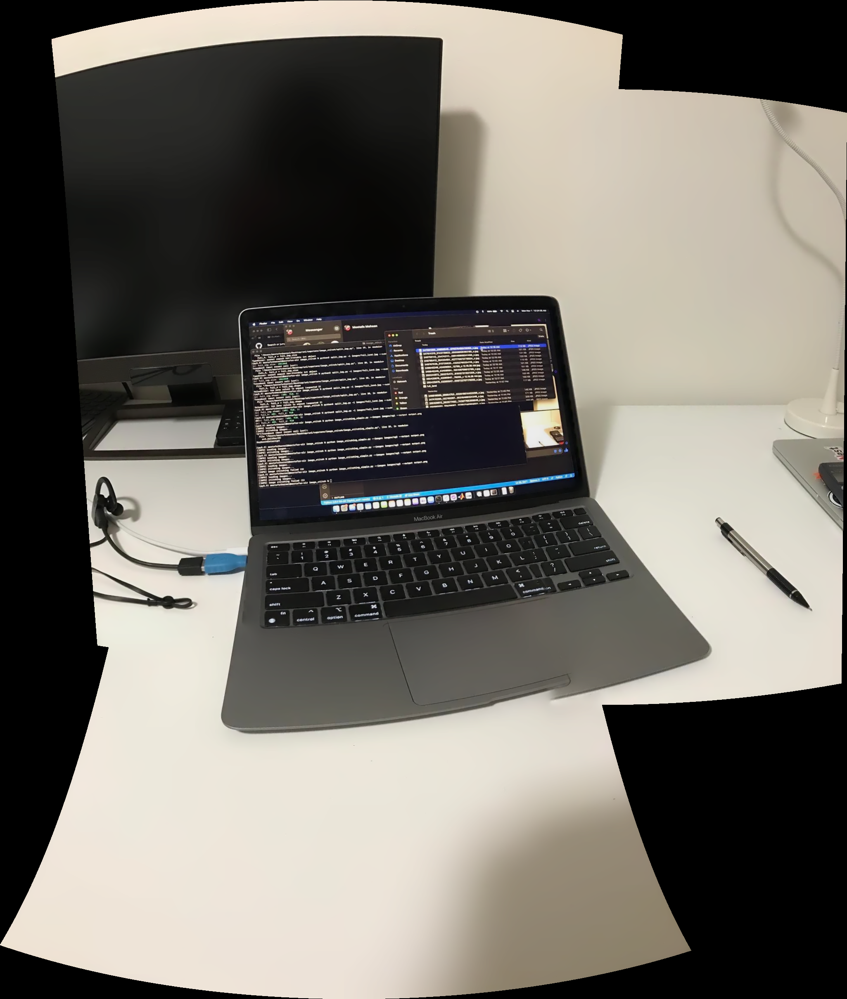

# image_stitch

## Using 4 cropped images from the same perspective 
| im1             | im2 |
:-------------------------:|:-------------------------:
  |  
| im3            | im4 |
  |  

### Result

## Using 4 images of different perspectives

| im1             | im2 |
:-------------------------:|:-------------------------:
  |  
| im3            | im4 |
  |  

### Result

